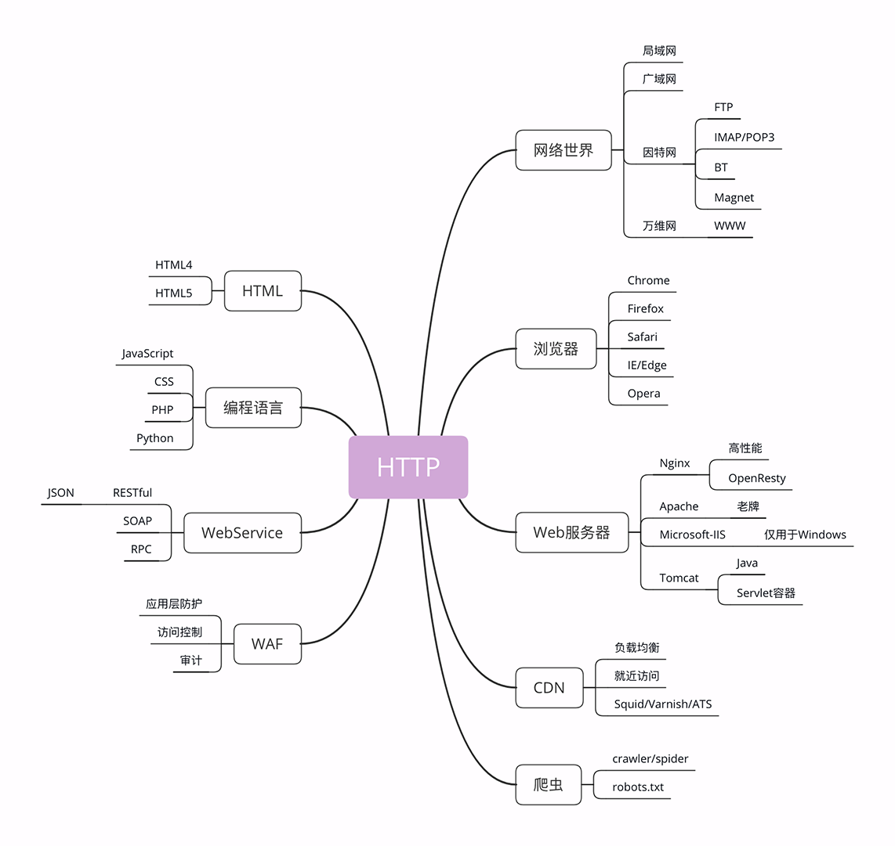

# 一些常见概念

1. 互联网上绝大部分资源都使用 HTTP 协议传输

2. 浏览器是 HTTP 协议里的**请求方**，即 User Agent

3. 服务器是 HTTP 协议里的**应答方**，常用的有 Apache 和 Nginx

4. **CDN 位于浏览器和服务器之间**，主要起到**缓存加速**的作用

   **CDN**，全称是“Content Delivery Network”， 内容分发网络，应用了 HTTP 协议的缓存和代理技术，代替源站响应客户端的请求

   > 打个比方，就好像唐僧西天取经，刚出长安城，就看到阿难与迦叶把佛祖的真经递过来了，是不是很省事？

5. 爬虫是另一类 User Agent，是自动访问网络资源的程序

6. TCP/IP 是网络世界最常用的协议，HTTP 通常运行在 TCP/IP 提供的可靠传输基础上

7. DNS 域名是 IP 地址的等价替代，需要用域名解析实现到 IP 地址的映射

8. URI 是用来标记互联网上资源的一个名字，由“协议名 + 主机名 + 路径”构成，俗称 URL

   > 比方说我让对象帮我去楼下超市买瓶水，DNS 可以帮他找到楼下超市，URI 可以帮他找到水放在超市的具体位置

9. HTTPS 相当于“HTTP+SSL/TLS+TCP/IP”，为 HTTP 套了一个安全的外壳

   SSL 使用了许多密码学最先进的研究成果，综合了对称加密、非对称加密、摘要算法、数字签名、数字证书等技术，能够在不安全的环境中为通信的双方创建出一个秘密的、安全的传输通道，为 HTTP 套上一副坚固的盔甲

10. 代理是 HTTP 传输过程中的“中转站”，可以实现缓存加速、负载均衡等功能

    代理的种类：

    1. 匿名代理：完全隐匿被代理的机器，外界只能看到代理服务器
    2. 透明代理：在传输过程中是 “透明开放的”，外界既知道代理，也知道客户端
    3. 正向代理：**靠近客户端**，代表客户端向服务器发送请求
    4. 反向代理：**靠近服务器端**，代表服务器响应客户端的请求

    代理在传输过程中可以实现的功能：

    	1. 负载均衡：请求分散，访问集群化
     	2. 内容缓存：暂存上下行数据，减轻后端压力
     	3. 安全防护：隐匿 IP，使用 WAF 等工具抵御网络攻击，保护被代理的机器
     	4. 数据处理：提供压缩、加密等额外的功能